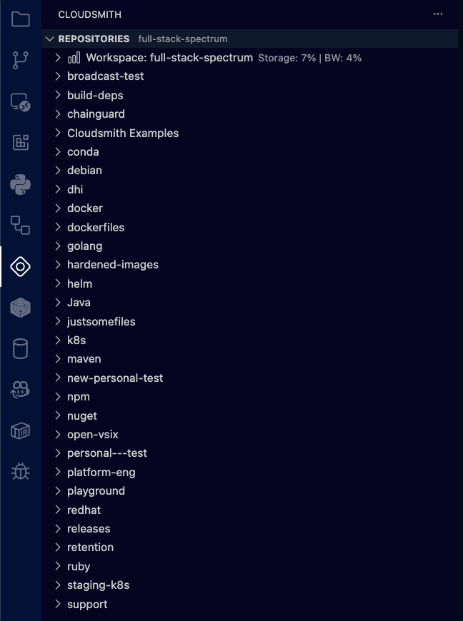
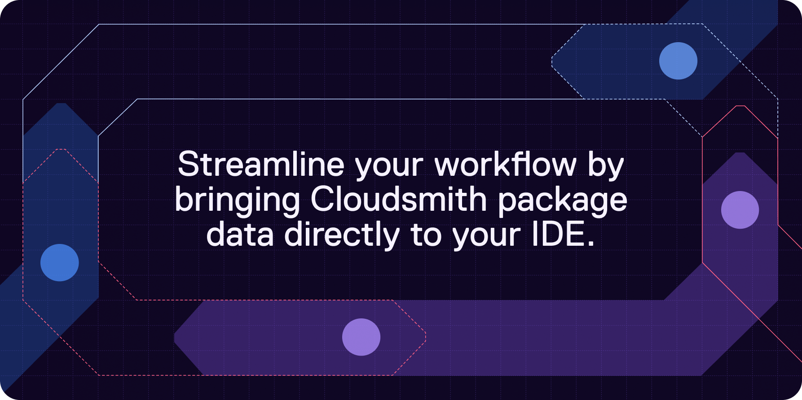
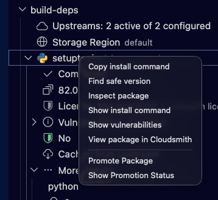

# Cloudsmith Visual Studio Code Extension

## Installation

To install the extension, we recommend installing directly from the Visual Studio Code or OpenVSX marketplaces. Open the Extensions view, search for `cloudsmith` to filter results and select the Cloudsmith extension authored by Cloudsmith.

### Connect to Cloudsmith

After installing, to connect to your Cloudsmith instance, you can utilize an API Key, Service Account Token, import from a local Cloudsmith CLI, or Sign in with SSO.

- **API Key** — Enter your API key directly in the extension settings.
- **Service Account Token** — Use a service account token for non-interactive authentication.
- **CLI Credential Import** — Reads API keys from `~/.cloudsmith/config.ini` with cross-platform path detection. Auto-detects CLI credentials on extension activation with a prompt to import.
- **SSO Sign-in (Experimental)** — Browser-based SSO flow gated behind the `experimentalSSOBrowser` setting.
  - SSO terminal flow opens an integrated terminal to run `cloudsmith auth -o {workspace}` for interactive SAML/2FA authentication.

## Features

### Package Explorer

The Cloudsmith extension contributes a dedicated Cloudsmith view to VS Code. The Cloudsmith Explorer lets you browse and manage packages stored within your Cloudsmith assets: **workspaces**, **repositories**, and **packages**.

#### Show Packages or Package Groups

By default the extension returns individual packages. You can display them as [package groups](https://help.cloudsmith.io/docs/package-groups) instead.

#### Package Details

A selection of important fields are available directly under a package. This varies depending on whether you are viewing packages or package groups. This is a subset of the full API response schema for [packages](https://help.cloudsmith.io/reference/packages_list) and [groups](https://help.cloudsmith.io/reference/packages_groups_list). You can inspect a package to obtain the full response.

You can right-click on each detail and copy the value to the clipboard.

##### Package Fields

- Status
- Format
- Name
- Slug
- Slug Perm
- Version
- Description
- License
- Size
- Number of downloads
- Tags
- Uploaded at date/time
- Checksum (SHA256)
- Repository
- Namespace

##### Package Group Fields

- Count of packages in group
- Format
- Name
- Version
- Description
- License
- Size
- Number of downloads
- Tags
- Last pushed date/time
- Namespace

#### Package Context Menus

The right-click menu provides access to the following commands, varying depending on whether you have enabled the package groups setting.

##### Package Commands

- **Inspect package** — View the full raw JSON API response for the package.
- **Copy Install Command** — Copy the installation command for the package to the clipboard.
- **Show Install Command** - Show the installation command for the package.
- **Show vulnerabilities** - Open a webview showing the vulnerabilities report for a package.
- **View package in Cloudsmith** - Open the package page in the Cloudsmith web UI for the configured workspace.
- **Promote Package** - Promote the package between configured repositories.
- **Show Promotion Status** - Show the current status of the package promotion request.
- **Find safe version** - Show possible safe versions of the package within Cloudsmith for quick remediation.

### Repository Explorer

Browse all repositories within a workspace. Repositories are displayed as children of their parent workspace. Each repository shows its packages (or package groups) as children.

### Workspace Switching

If you have access to multiple workspaces, the explorer lets you switch between them to browse different sets of repositories and packages.

### Search & Filtering

- **Search packages** — Search for packages within a repository using a search query.
- **Filter by format** — Filter packages by their format type.
- Pagination support for large result sets.

### Vulnerability Information

View vulnerability data associated with packages directly in the explorer, including security scan results when available.

### Dependency Health

The Dependency Health view scans your project's manifest and lockfiles, cross-references every declared and transitive dependency against your Cloudsmith workspace, and shows coverage, vulnerability, license, and policy status at a glance.

#### Transitive Resolution

The extension parses lockfiles and manifests directly. Most ecosystems resolve the full dependency tree from an existing lockfile. For ecosystems without a standard lockfile, the extension parses the manifest for direct dependencies and can optionally parse a generated dependency tree for transitives.

| Ecosystem | Automatic (lockfile) | Direct only (manifest) | Notes |
|-----------|---------------------|----------------------|-------|
| npm / Yarn / pnpm | package-lock.json, yarn.lock, pnpm-lock.yaml | package.json | |
| Python | poetry.lock, uv.lock, Pipfile.lock | pyproject.toml, requirements.txt | requirements.txt provides direct deps only |
| Maven | | pom.xml | Run `mvn dependency:tree -DoutputFile=dependency-tree.txt` once to enable transitive resolution |
| Gradle | gradle.lockfile | build.gradle, build.gradle.kts | Run `gradle dependencies` once if dependency locking is not enabled |
| Go | go.mod | | go.mod marks direct vs indirect natively |
| Rust | Cargo.lock | Cargo.toml | |
| Ruby | Gemfile.lock | Gemfile | |
| Docker | | Dockerfile, docker-compose.yml | All dependencies are direct (base images) |
| NuGet | packages.lock.json | | |
| Dart | pubspec.lock | | |
| PHP | composer.lock | | |
| Helm | Chart.lock | | Helm dependencies are all direct |
| Swift | Package.resolved | | |
| Elixir | mix.lock | | |

#### View Modes

- **Direct only** — shows only top-level manifest dependencies.
- **All (flat)** — shows every resolved dependency in a flat list with direct/transitive labels.
- **All (tree)** — shows the full dependency hierarchy. Diamond dependencies are collapsed to keep the tree manageable.

#### Overlays

Each dependency found in Cloudsmith is enriched with:
- **Vulnerability status** — severity count and max severity inline, with click-through to CVE details.
- **License classification** — permissive, weak copyleft, or restrictive, with configurable flagging.
- **Policy compliance** — quarantine and policy violation indicators.

Dependencies not found in Cloudsmith show upstream proxy reachability — whether a configured upstream could serve them.

#### Pull Through Upstream

Click "Pull dependencies" to cache uncovered dependencies through a repository's upstream proxy. The extension shows only repositories with matching upstream formats, pulls in parallel, and automatically rescans after completion. You can also right-click any individual dependency to pull just that one package.

#### Compliance Report

The report view opens a styled summary panel with coverage percentage, vulnerability breakdown by severity, license risk summary, policy compliance, and upstream gap analysis.

### Configuration & Settings

The extension exposes several settings under `cloudsmith-vsc.*`:

| Setting | Description |
|---|---|
| `cloudsmith-vsc.groupByPackageGroups` | Display packages as package groups instead of individual packages. Default: `false`. |
| `cloudsmith-vsc.inspectOutput` | When enabled, inspect output opens in a new text document instead of the Output tab. Default: `false`. |
| `cloudsmith-vsc.showMaxPackages` | Maximum number of packages returned per repository (1–30). Default: `30`. |
| `cloudsmith-vsc.defaultWorkspace` | Cloudsmith workspace slug to load by default. Leave empty to show all accessible workspaces. |
| `cloudsmith-vsc.showPermissibilityIndicators` | Show visual indicators for quarantined packages and policy violations. Default: `true`. |
| `cloudsmith-vsc.showLicenseIndicators` | Show license risk classification on packages. Default: `true`. |
| `cloudsmith-vsc.flagRestrictiveLicenses` | Color-code restrictive licenses in the Dependency Health view. Default: `true`. |
| `cloudsmith-vsc.restrictiveLicenses` | List of SPDX license identifiers flagged as restrictive. Default: `["AGPL-3.0", "GPL-2.0", "GPL-3.0", "SSPL-1.0"]`. |
| `cloudsmith-vsc.showDockerDigestCommand` | Show an additional "Pull by digest" option for Docker install commands. Default: `false`. |
| `cloudsmith-vsc.experimentalSSOBrowser` | Enable experimental browser-based SSO authentication. Default: `false`. |
| `cloudsmith-vsc.autoScanOnOpen` | Automatically scan project dependencies against Cloudsmith when a workspace is opened. Default: `false`. |
| `cloudsmith-vsc.dependencyScanWorkspace` | Cloudsmith workspace slug to use for dependency health scanning. |
| `cloudsmith-vsc.dependencyScanRepo` | Cloudsmith repository slug to use for dependency health scanning. |
| `cloudsmith-vsc.resolveTransitiveDependencies` | Parse lockfiles to resolve transitive dependencies. When disabled, only direct manifest dependencies are shown. Default: `true`. |
| `cloudsmith-vsc.dependencyTreeDefaultView` | Default view mode for the Dependency Health panel: `direct`, `flat`, or `tree`. Default: `flat`. |
| `cloudsmith-vsc.maxDependenciesToScan` | Maximum number of dependencies to display. Pull operations always process all dependencies regardless of this limit. Default: `10000`. |
| `cloudsmith-vsc.searchPageSize` | Number of results per page when searching packages (10–100). Default: `50`. |
| `cloudsmith-vsc.recentSearches` | Number of recent searches to remember (0–50). Default: `10`. |

### Commands

All commands are available via the Command Palette (`Cmd+Shift+P`):

| Command | Description |
|---|---|
| `Cloudsmith: Set Up Cloudsmith Authentication` | Configure Cloudsmith authentication using an API key, service account token, or imported credentials. |
| `Cloudsmith: Import CLI Credentials` | Import credentials from the Cloudsmith CLI config. |
| `Cloudsmith: Sign in with SSO` | Authenticate using SSO (experimental). |
| `Cloudsmith: Inspect Package` | View the full raw JSON for a package. |
| `Cloudsmith: Open in Cloudsmith` | Open the selected item in the Cloudsmith web UI. |
| `Cloudsmith: Copy to Clipboard` | Copy a package detail value to the clipboard. |
| `Cloudsmith: Refresh Packages` | Refresh the Cloudsmith explorer tree. |
| `Cloudsmith: Search Packages` | Search for packages within a repository. |
| `Cloudsmith: Scan Dependencies` | Scan project lockfiles and check dependency coverage against Cloudsmith. |
| `Cloudsmith: Pull Dependencies` | Pull uncovered dependencies through a repository's upstream proxy. |
| `Cloudsmith: Pull Dependency` | Pull a single dependency through an upstream proxy (right-click context menu). |
| `Cloudsmith: View Compliance Report` | Open the dependency health compliance report in an editor panel. |
| `Cloudsmith: Cycle Dependency View` | Switch between direct, flat, and tree view modes. |
| `Cloudsmith: Sort and Filter Dependencies` | Open sort and filter options for the Dependency Health view. |

## License

Apache 2.0