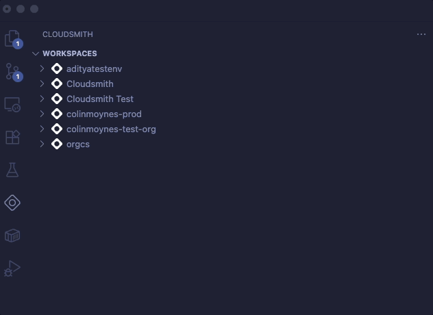

# Cloudsmith Visual Studio Code Extension

Bringing Cloudsmith to Visual Studio Code! You can now explore your Cloudsmith packages directly within Visual Studio Code. 

## Installation

To install the extension, open the Extensions view, search for `cloudsmith` to filter results and select the Cloudsmith extension authorised by Cloudsmith. 

To connect to your Cloudsmith isntance, you need to configure either your own Personal API Key or a Service Account Token. Click on the `key` icon from the view menu and enter your credential into the input box. To connect press the `connect` or `refresh` icons. 

* Entitlement tokens are not supported. 

* Personal API Keys provide support for accessing mulitple Cloudsmith Workspaces if access is granted. A Service Account Token will provide access to a specific Workspace only. 

### Settings

A range of settings are configurable for the extension. See Overview for usage of these. 

* Show Packages via individual Package or Package Group
* Inspect Output - choose where you want to send inspect output
* Maximum packages to show per repository. Max is limited to 30. 
* Use Legacy Web App - URLs to Cloudsmith packages will use the legacy Web App instead. 

## Overview

### Package Explorer

The Cloudsmith extension contributes a Cloudsmith view to VS Code. The Cloudsmith Explorer lets you examine packages stored within your Cloudsmith assets: workspaces, repositories, packages. 

#### Show Packages or Package Groups

By default the extension returns individual packages. You can display them as [package groups](https://help.cloudsmith.io/docs/package-groups) instead. 

#### Package Details

A selection of important fields are available directly under a package. This will vary depending on package vs package group. This is a subset of the full api response schema for [packages](https://help.cloudsmith.io/reference/packages_list) and [groups](https://help.cloudsmith.io/reference/packages_groups_list). You can inspect the package to obtain the full response. 

You can right-click on each detail and copy the value to the clipboard.  

##### Package

- Status
- Name
- Slug
- Slug Perm
- Number of downloads
- Version
- Tags
- Uploaded at date/time

##### Package Group

- Count of packages in group
- Size
- Number of downloads
- Last pushed date/time

#### Package Context Menus

The right-click menu provides access to the following commands varying depending on whether you have enabled the package groups setting. 

#### Package Inspect

Selecting inspect will return the raw JSON data for the selected item. By default it will send the output to the `Output` window. You can configure for output to be sent to a new text document instead. 

#### Open Package in Cloudsmith

You can open the package directly in your Cloudsmith Web App.

## Release Notes

### 1.0.0 - July 2025

* Initial release of the Cloudsmith extension. The extension provides a package explorer view into your Cloudsmith instance. 
* Future releases will continue to build upon this with futher capabilities and features to closely match the [Cloudsmith CLI](https://help.cloudsmith.io/docs/cli). 

---

## Contributing

## License

**Enjoy!**
